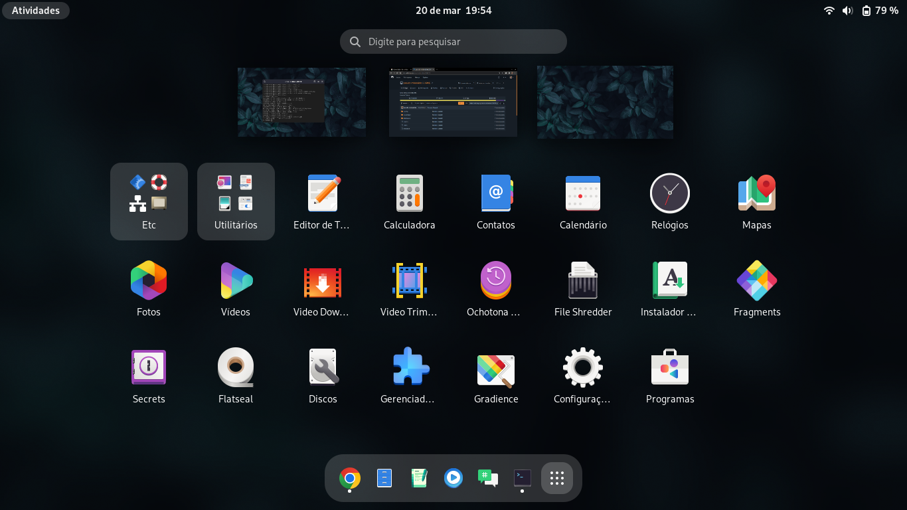
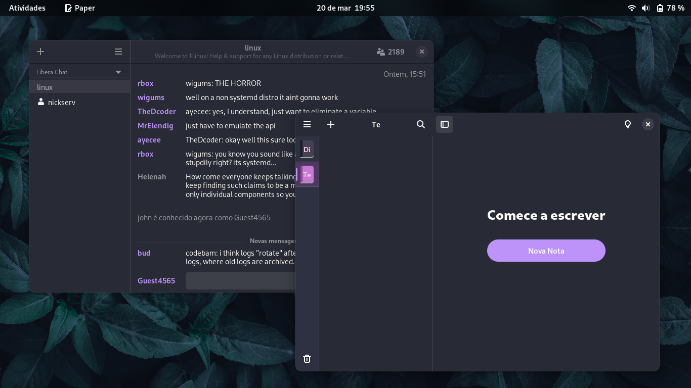

## Meu setup do GNOME.

Isso é só um repositório para backup do meu setup do GNOME,  
porém, se você tiver interesse, tem um script feito para o  
arch chamado `instalar.sh`.

Eu o fiz para agilizar o processo de configurar o meu desktop  
com os programas que uso e com as minhas costumizações  
(por mais que sejam poucas).  

## Aqui estão algumas screenshots  
  
